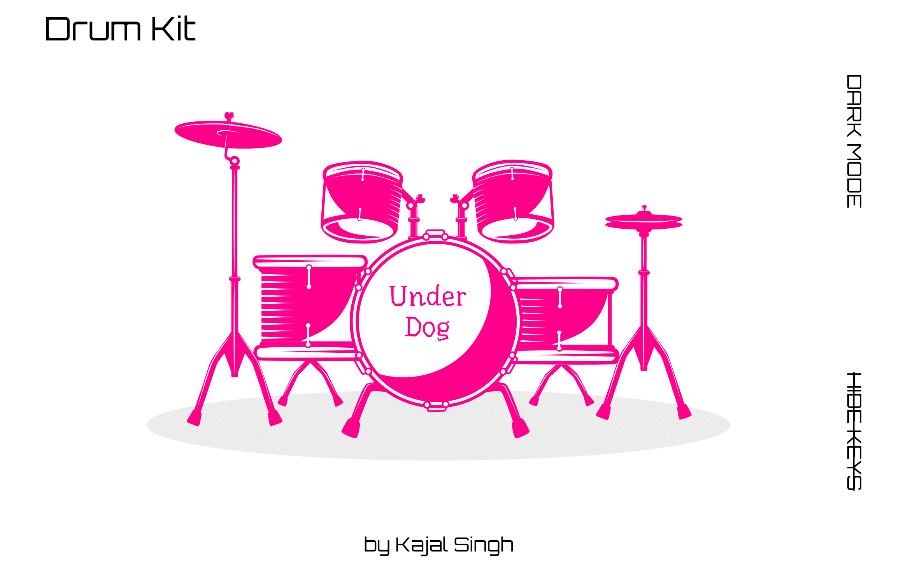

# Drum Kit 

## Description
The Drum Kit project is a fully interactive web application that showcases a custom-drawn drum kit in Figma, serving as the centerpiece of the website. The drum kit is created entirely using Scalable Vector Graphics (SVG), and different sections of the kit are grouped together using the g element. The project also utilizes the text element inside SVG to insert text representing different keyboard keys.

Watch the [demo](https://kajal-singh5.github.io/drumKit/) here.

## Features
- Click or tap on the drum kit instruments to play sounds.

- Play the instruments by pressing the respective keyboard keys associated with each drum sound.

- Each instrument has a variety of sounds at different tempos stored in an array of audios.

- Dark mode toggle button to switch between light and dark themes, implemented using pure CSS.

- Button to hide/show keyboard keys for a cleaner interface, also implemented using pure CSS.

## Technologies Used
- HTML

- CSS

- JavaScript

## Design Assets
All design assets were created by me using Figma. The original design file can be viewed by going on the following link: [Interactive Drum Kit](https://www.figma.com/file/Xc0Jcv0w4SI1jwdMIU91NN/Drum-Kit-V2?type=design&node-id=0%3A1&mode=design&t=GhG5Mmiwdbl6jcvb-1).

## Credits
Drum kit sound samples obtained from [FesliyanStudios](https://www.fesliyanstudios.com/).
